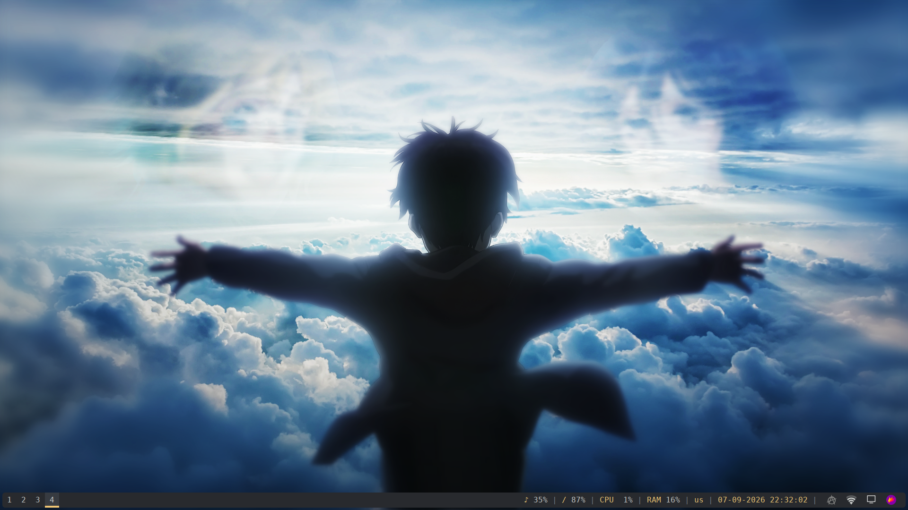
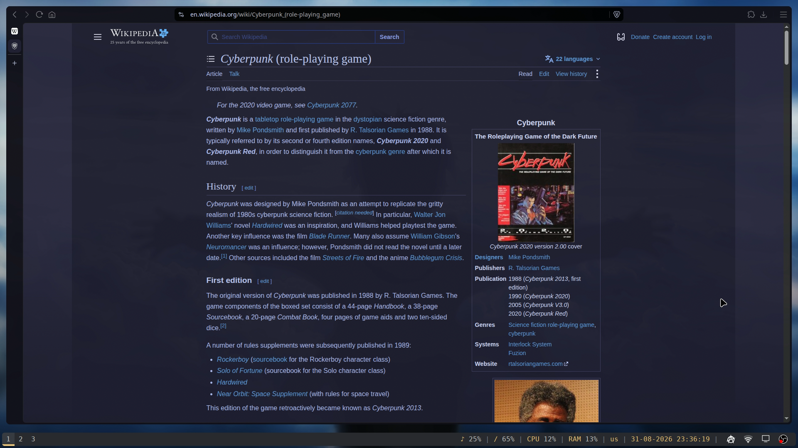
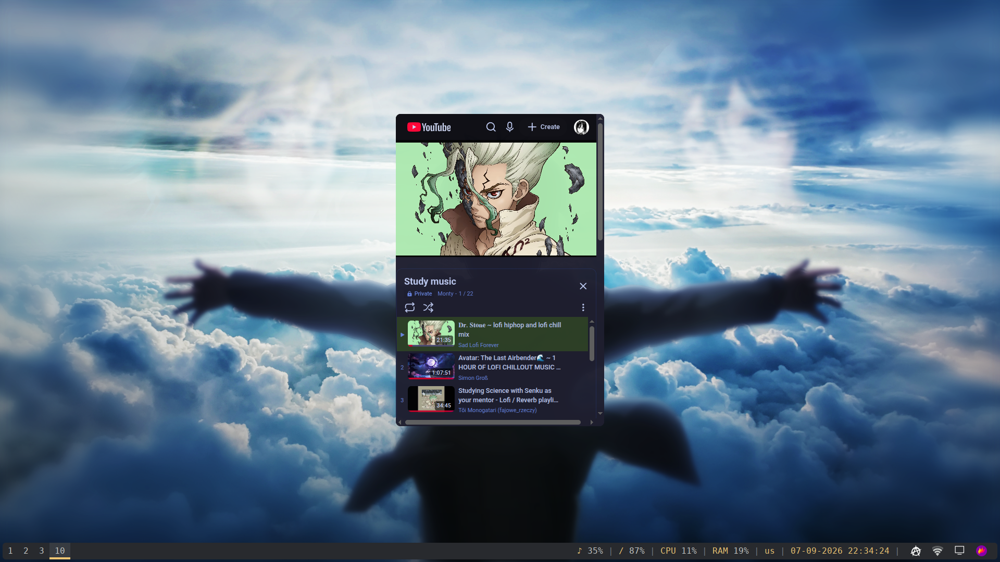
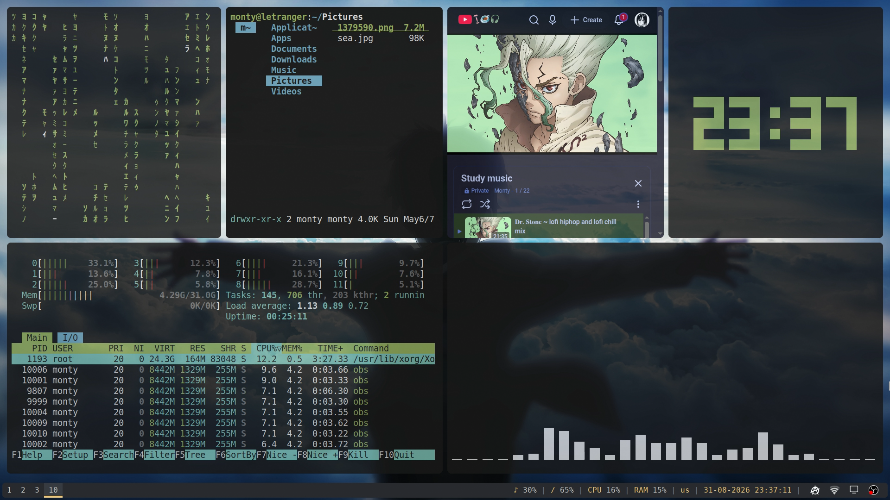
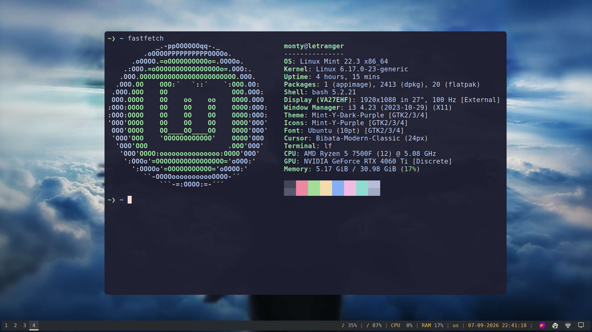
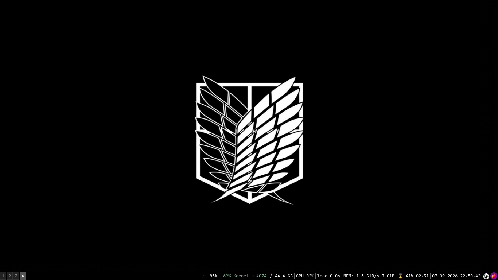
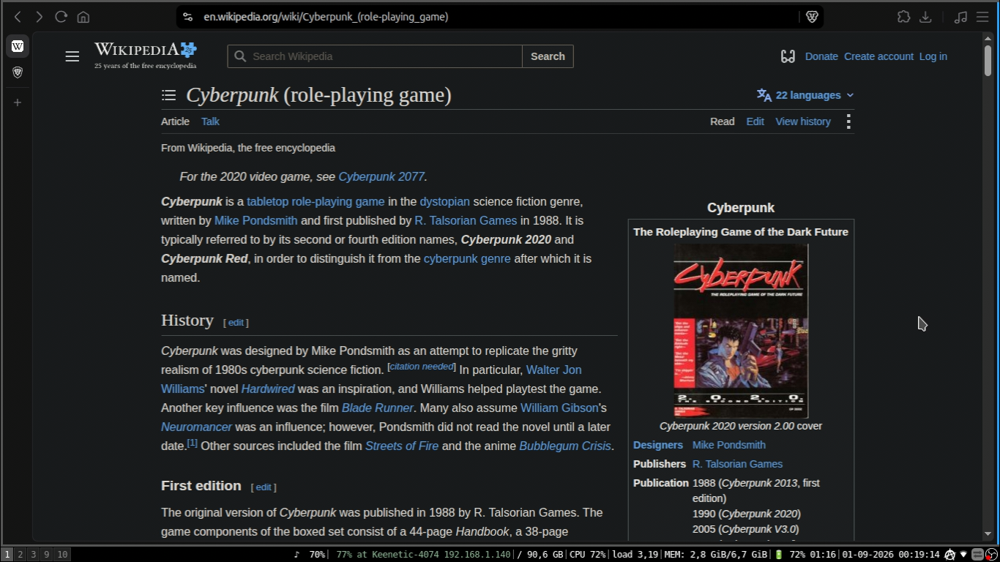
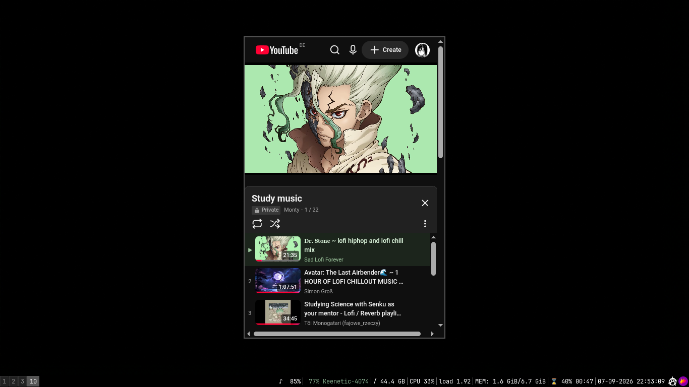
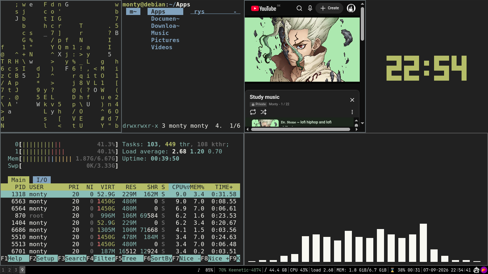
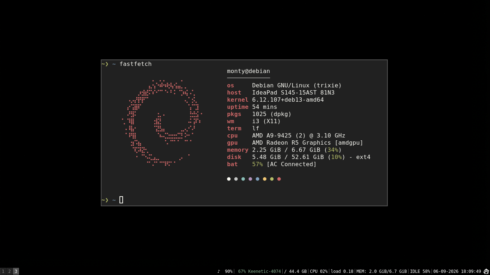

# Minimal & Aesthetic i3wm Dotfiles

<p align="center">
  
  
  
  
  
</p>

<p align="center">
  
  
  
  
  
</p>

* **Desktop:** Soft purple-blue aesthetic with rounded corners via Picom, a custom Polybar, and an automated multi-tile dashboard.
* **Laptop:** Distraction-free monochrome environment styled with stock `i3status` bar on Debian.

---

## Environment Overview

| Component | Desktop | Laptop |
| :--- | :--- | :--- |
| **OS** | Linux Mint (X11) | Debian (X11) |
| **Window Manager** | i3wm / i3-gaps | i3wm |
| **Status Bar** | Polybar | i3bar + i3status |
| **Compositor** | Picom (`glx` backend, 10px corners) | None |
| **Terminal** | Alacritty | Alacritty |
| **Font** | JetBrainsMono Nerd Font | JetBrainsMono Nerd Font |
| **GTK Theme** | Mint-Y-Dark-Purple | Adwaita-dark (Papirus-Dark icons) |
| **Cursor** | Bibata-Modern-Classic | Bibata-Modern-Classic |

---

## Installation

### 1. Base Dependencies

Install the utilities via APT:

```bash
sudo apt update
sudo apt install i3 picom polybar feh rofi alacritty cava htop dunst micro mpv xsettingsd tty-clock
```

Additional tools:
* **lf:** Download from [lf releases](https://github.com/gokcehan/lf/releases) to `~/.local/bin/`
* **fastfetch:** CLI system information tool
* **unimatrix:** Matrix script in `$PATH`

---

## Deploying via GNU Stow

**Desktop Setup:**

```bash
cd ~/dotfiles
stow -t ~ desktop
```

**Laptop Setup:**

```bash
cd ~/dotfiles
stow -t ~ laptop
```

*(Alternatively, manually copy the contents of `desktop/.config` or `laptop/.config` into your `~/.config/` directory).*

---

## Configuration & Hardware Adjustments

* **Laptop Network Interface:** Open `~/.config/i3status/config` and replace `wlp3s0` with your machine's wireless interface identifier (run `ip link` to find yours).
* **Wallpapers:** Set directly inside `~/.config/i3/config` via `exec_always feh --bg-fill ~/.config/wallpapers/<image-name>` (all wallpaper assets are bundled in `~/.config/wallpapers/`).* **Workspace Dashboard (Desktop):** The included script `~/.config/i3/launch_dashboard.sh` automatically splits and spawns a pre-arranged terminal grid (`unimatrix`, `lf`, `htop`, `tty-clock`, and `cava`) on workspace 10.

